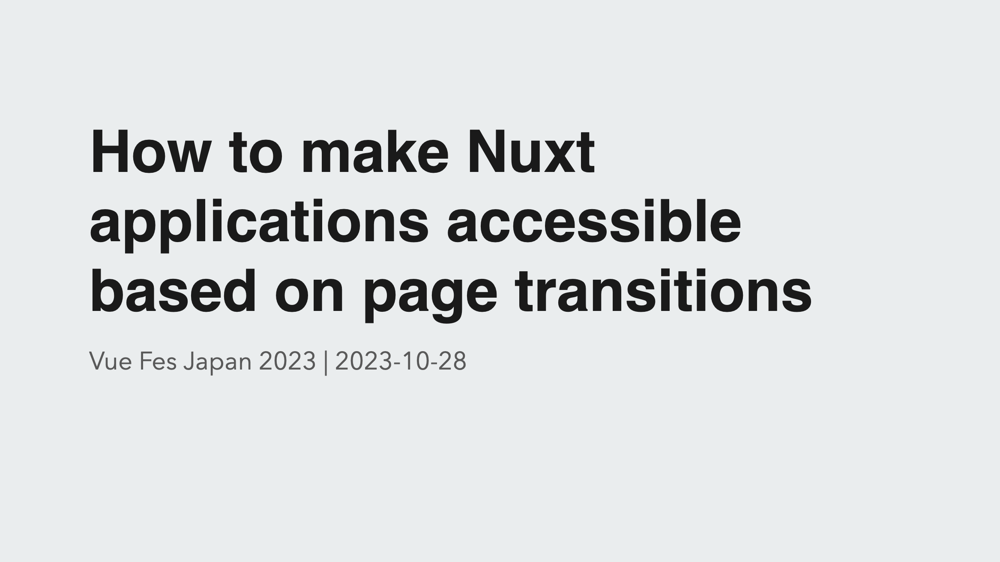

## Translation Articles

[English page](https://yamanoku.net/vuefes-japan-2023/en/) / [日本語ページ](https://yamanoku.net/vuefes-japan-2023/ja/)

## Introduction

First, let me introduce myself.


My name is [yamanoku](https://yamanoku.net).

I was engaged in the development of initiatives and the development of design systems as a front-end engineer at [CrowdWorks, Inc](https://crowdworks.co.jp/en/). Currently, I belong to a team leading the resolution of technical debt and am involved in refreshing the legacy front-end environment.

I am interested in web specifications and issues related to web accessibility.

In addition, I am a father of one child, and I have a Golden Retriever and three cats.

Before we get to the main topic, let me explain what **web accessibility**, which is related to today’s theme, is all about.

Accessibility is a word that combines "access" and "ability", and it is used to mean making information, products, and services available. It is sometimes abbreviated as *A11y*.


Web accessibility refers to accessibility in the context of the web, and it is defined as "the ability for users to access information and services provided on the web, regardless of the presence or extent of disabilities, age, or usage environment, or the degree of accessibility to those resources".

When discussing web accessibility, there is an important point that should be understood first: "Originally, the web is supposed to be accessible".

Please recall the period during the COVID-19 pandemic when many people were forced to work remotely. During that time, we were able to obtain and disseminate information online.

This is an example of how things have become accessible through the medium of the web.

Thanks to the web, individuals with disabilities have become able to access a variety of resources through web services, including:

* Web searches
* Reading news and newspapers
* Browsing blogs and social media
* Navigation when going out
* Transfer searches
* Checking account statuses for shopping and financial services
* Various procedures using My Portal and the My Number card, etc.

This information is based on a survey regarding the usage of assistive technologies for visually impaired individuals, revealing that they utilize various services via computers and smartphones.

Ensuring web accessibility serves as a means to provide equitable services to people with disabilities, allowing individuals from diverse backgrounds to utilize these services.

For this occasion, [Vue Fes Japan 2023](https://vuefes.jp/2023/), I would like to introduce a timely topic related to Japan and web accessibility.

It pertains to the **Partial Amendment of the Basic Act on Persons with Disabilities（障害者基本法の一部改正）** and the **Environmental Adjustment（環境の整備）**.

The Act for Eliminating Discrimination against Persons with Disabilities aims to eradicate discrimination based on disability and realize a society where people, with or without disabilities, live together while acknowledging each other's individuality.

Under this law, instead of unfairly discriminating against people with disabilities, measures and considerations are required to alleviate and resolve the difficulties they face in their daily lives.

From April of next year, providing reasonable accommodations for people with disabilities will become a legal obligation, not just an effort obligation, for private companies as well.

**Reasonable accommodation（合理的配慮）** refers to special support and adjustments needed when a person with a disability participates in society. This can take various forms.

For example, if a person with a disability has difficulty writing, they could receive assistance from someone else to write on their behalf. When communicating, trying out picture cards, photo cards, or tablet devices could be beneficial. Additionally, providing support for mobility to people with physical disabilities can also be considered a part of reasonable accommodation.

Reasonable accommodations require providing support according to the individual needs of the person with a disability, within a reasonable range, whenever they experience difficulties.

However, when interactions with individuals requiring reasonable accommodations extend over a long period, addressing their needs each time can become a burden for both parties. To reduce this burden, it is essential to consider efficient and sustainable support methods.

Taking preemptive improvement measures can facilitate the smooth provision of reasonable accommodations to individuals with disabilities in various situations. This is referred to as **Environmental Adjustment**.

For example, in situations where communication with a person who has a hearing impairment is necessary, preparing input devices such as tablets in advance enables them to input by themselves, eliminating the need for assistance or external support each time.

Web accessibility is positioned not as reasonable accommodation itself, but as a form of environmental adjustment, undertaken as a preemptive measure.

As explained in the previous section on reasonable accommodations, even matters that could only be addressed via phone calls or writing can now be handled asynchronously through the web, enabling individuals to make inquiries or input.

By achieving web accessibility, an increase in user satisfaction is expected, along with a reduction in inquiries and improved overall work efficiency.

Understanding the importance of web accessibility, there's something crucial we need to revisit.

It’s about whether the applications we have developed in the past, and are currently developing, using Vue.js or Nuxt.js, are actually accessible.

At the previous Vue Fes Japan, the theme was "[To make accessible components in Vue.js](https://yamanoku.net/vuefes-japan-online-2022/en/)", where I talked about incorrect approaches to accessibility, and how to leverage Vue.js’s strengths for accessibility considerations and testing.

During that session, I addressed the accessibility support status of client-side frameworks according to [WebAIM](https://webaim.org/), an organization dedicated to accessibility.


Although the numbers are showing a trend of improvement, the results are still concerning as of 2023, and this is something that personally worries me.

I am aiming, including myself, to enable developers who use Vue.js and Nuxt.js to continue their development with accurate consideration of web accessibility. I hope to address this point in my presentation today.

This time, I would like to focus on accessibility in terms of "page transitions."

Thank you once again for your attention.

### The Technique of Client-Side Routing

First and foremost, let's delve into the concept of **Client-Side Routing**.

In typical page transitions, the server-side generates new page HTML and sends it to the client for display. This is considered the standard form of routing. On the other hand, client-side routing is a technique that completes all processes on the client side.

This method is utilized in Single Page Applications or when dynamically updating a portion of the screen.

Client-side routing offers several advantages:

- Faster page navigation
- Client-side state preserved across navigation
- Nested Layouts
- Custom page transition animations

These features significantly contribute to enhancing the user experience of websites and applications.

Speaking of transition animations between pages, there is the [View Transitions API](https://developer.mozilla.org/ja/docs/Web/API/View_Transitions_API), which has been increasingly introduced in various client frameworks recently. In Nuxt.js, it has been introduced as experimental from [version 3.4](https://nuxt.com/blog/v3-4).

Please note that if you use it as is, it will only work in browsers that support the View Transitions API, since there is no fallback for browsers that do not support it at this time.

Let's take a look at an actual demo.

<video src="https://user-images.githubusercontent.com/904724/231222082-6bd4aeae-3026-407e-b3be-658df6305748.mp4" controls style="width: 100%; border: 1px solid var(--y-image-border-color);" loop></video>

With each page transition, you can see an effect as if the clicked target area is expanding.

Because you can add transition effects between two different elements, it becomes possible to achieve even more advanced page transitions, beyond what was possible with transitions across entire pages or single components.

With the increasing number of techniques available for smooth page transitions, and with the barriers to implementation becoming lower, I believe that client-side routing has become more accessible than when single-page applications first started to appear.

## Accessibility Issues in Page Transitions

While client-side routing has become more convenient and accessible, there are accessibility issues that can be overlooked due to this technology. Next, we will introduce these issues and discuss potential solutions.

### Assistive Technologies May Not Detect Changes

Firstly, there is an issue where assistive technologies may not detect what has changed. This is one of the most difficult problems to notice when considering the accessibility of page transitions.

Assistive technology refers to the collective term for hardware and software used as aids to help people with disabilities utilize and operate web.

Although visually it might be clear which part of the screen has changed during a client-side routing transition, users who rely on assistive technologies to navigate the page may find it difficult to notice these changes.

Let's take a look at how client-side routing works using a screen reader, a type of assistive technology that reads out the content on the screen.

<video src="../videos/demo-movie-01.mov" controls style="width: 100%; border: 1px solid var(--y-image-border-color);"></video>

As we can see, even though the page visually transitions correctly, users utilizing screen readers may not be notified of these changes.

How can we circumvent this issue?

One solution involves leveraging WAI-ARIA, a set of technical specifications for making web content more accessible. Within WAI-ARIA, there is a feature called [ARIA Live Region](https://developer.mozilla.org/en-US/docs/Web/Accessibility/ARIA/ARIA_Live_Regions), which is used to notify users of dynamic content changes.

An accessible method to notify users during page transitions is to use ARIA Live Regions to announce changes in the `title` element.

Let's delve into the specific techniques.

First, specify the page's `title` using `useHead` at a page level.

```ts
useHead({
  title: 'About Page',
});
```

Next, fetch the title element and detect changes whenever the page transitions.

```ts
const route = useRoute();
const message = ref<string>("");

const announceRoute = () => {
  const title = document.title;
  message.value = title;
};

onMounted(() => {
  announceRoute();
});

watch(
  () => route.fullPath,
  () => {
    setTimeout(() => {
      announceRoute()
    }, 300);
  }
);
```

In this example, we are detecting changes based on the route's path. Using `setTimeout`, we introduce a slight delay to compensate for potential notification timing issues with assistive technologies.

Then, integrate the notification variable into the HTML side.

```html
<p
  role="status"
  aria-live="assertive"
  class="visually-hidden"
>
  ｛｛ message ｝｝
</p>
```

By using WAI-ARIA's `aria-live`, you can ensure that `assistive` technologies are notified. Using assertive as the value ensures that changes are announced immediately, capturing the user's attention.

The corresponding HTML element is used solely for detection by screen readers, and as such, it is typically hidden from view on the screen.

```css
.visually-hidden {
  position: absolute;
  width: 1px;
  height: 1px;
  padding: 0;
  margin: -1px;
  overflow: hidden;
  clip: rect(0, 0, 0, 0);
  white-space: nowrap;
}
```

A critical point to note here is that hiding the element using `display: none` would render it undetectable by assistive technologies. Therefore, you must hide it **visually only**. This styling technique is commonly referred to as [Visually Hidden](https://www.a11yproject.com/posts/how-to-hide-content/).

Now, let's take a look at the changes together.

<video src="../videos/demo-movie-02.mov" controls style="width: 100%; border: 1px solid var(--y-image-border-color);"></video>

Thus, we have established a way to notify users when a link is clicked and the page transitions.

The Mastodon client for Nuxt.js, "[elk](https://github.com/elk-zone/elk)", utilizes this technique as a component.

- [elk/components/aria/AriaAnnouncer.vue](https://github.com/elk-zone/elk/blob/5d09e7d2ab473d3fe049ace8468455baa18de9b2/components/aria/AriaAnnouncer.vue)

When using assistive technologies to navigate the page, you can hear the current page title announced after the page has loaded.

The source code is available to the public, so if you are interested, feel free to check out how the actual application operates.

### Focus Management

Next, let's talk about keyboard navigation when the page transitions.

With keyboard navigation, there are various actions like deciding on items with the Enter or Space key, moving between items using the arrow keys, or canceling an action with the Escape key.

In this section, we will especially focus on issues related to moving the focus using the Tab key, and we will illustrate these issues through a demo.

<video src="../videos/demo-movie-03.mov" controls style="width: 100%; border: 1px solid var(--y-image-border-color);"></video>

When you select a link located at the bottom of the page, while the content on the screen does indeed update, the focus will move from its previous position, which is the link at the bottom.

This behavior might not pose a problem in certain situations, but in cases like the one demonstrated here, it becomes evident that this behavior can be highly inconvenient.

To solve such issues, it is necessary to insert a process that moves the focus to the element we want to navigate to next.

In Vue.js, to target a specific element, you can use `ref` to create a template reference.

```ts
const focusedRef = ref<HTMLElement>();
```

When navigating using the Tab key, elements like `a` or `button` can accept focus by default. However, some elements cannot be focused on naturally.

To solve this problem, you can use the `tabindex` attribute to make an element focusable.

```ts
onMounted(() => {
  if (focusedRef.value) {
    focusedRef.value.tabIndex = -1;
    focusedRef.value.focus();
  }
};
```

Setting this value to `-1` ensures that the element will not receive focus through normal keyboard interactions, which can prevent accidental operations. After this, you can then directly set the focus to the target element.

The next point to consider is where to place the focus after the page has transitioned.

When moving to a new page, the `main` element, which usually contains the primary content of the page, seems to be an appropriate choice for receiving initial focus. However, this approach has its issues.

Let's take a look at a specific example. Here, we will demonstrate behavior where the `main` element is focused upon transitioning to the About page.

<video src="../videos/demo-movie-04.mp4" controls style="width: 100%; border: 1px solid var(--y-image-border-color);"></video>

It might be subtle, but when the `main` element is focused, it ends up reading out all of its contents at once.

In this instance, there was only a small amount of content within the `main` element, so there was not much to read out. However, in a real-world scenario, it is expected that there would be more content than this.

This result is specific to [NVDA](https://www.nvda.jp/), a screen reader available on Windows. On the other hand, screen readers on macOS do not read out content in this manner, but it is important to note that screen reader behavior varies depending on the device and OS.

So, how should we solve this issue?

If the target is too large and ends up reading out everything at once, one method to consider is making the focus target element smaller.

<video src="../videos/demo-movie-05.mp4" controls style="width: 100%; border: 1px solid var(--y-image-border-color);"></video>

If there are heading elements present on the page, we recommend changing the behavior to move focus to those elements.

If there are no headings, another method could be to provide a skip link, moving the focus there, and reading out the page title using ARIA live region.

A skip link is a feature mainly for users who browse using a keyboard, referring to an in-page link that allows users to jump directly from the top of the page to the start of the main content.

While this technique is not mandatory for web accessibility, it is considered to be effective as there are users who will utilize skip links if they are available.

This method has been adopted by GitHub, allowing users to easily move from the top of the page to the element right before the main content, and from there, proceed to access the main content.


For information on how to create skip links, please refer to the [accessibility page in the Vue.js official documentation](https://ja.vuejs.org/guide/best-practices/accessibility.html#skip-link), where it is explained in detail.

Based on the above information, it can be said that it is preferable to choose areas with less content when deciding where to place the focus after a page transition.

There is no clear rule stating that the starting position of the focus **must always be here**. Depending on the situation, it might be easier for the user to understand if the focus position is not changed.

However, in such cases, users need to learn the behavior that "the position does not change." Therefore, it is important to basically set it up in such a way that, similar to page transitions on the server side, **the transition starts from the top of the browser**.

### Excessive Animation Hindering Browsing

Lastly, there is an issue where excessive animations can hinder browsing.

Using page transition animations can smoothen the flow of screen changes and enhance the user's sense of immersion.

However, this is not necessarily the optimal solution for all users. Particularly for users with vestibular or cognitive disabilities, animations can pose a risk of inducing nausea or causing confusion.

Many of today's PCs and smartphones provide a setting at the OS level to "Reduce motion".

This setting suppresses moving parallax effects on the screen and changes the display to be calmer. Particularly for smartphone users, some may have this setting turned on to extend their battery life.

To control the settings for reducing motion effects on the frontend side, you can use `prefers-reduced-motion`.

If you are setting up animations using JavaScript and the Web Animations API, you can retrieve the user's settings using the `matchMedia` method of the `window` object and control the animations using a `change` event listener.

```js
const mediaQuery = window.matchMedia('(prefers-reduced-motion: reduce)');
mediaQuery.addEventListener('change', () => {
  console.log(mediaQuery.media, mediaQuery.matches);
  // Stop JavaScript-based animations.
});
```

However, with this method, if the user changes their settings, it will be necessary to reload the browser to reflect the changes.

If you are using the Composition API with Vue.js, you can use a state management utility library called [VueUse](https://vueuse.org/). This library includes [composition functions related to motion preferences](https://vueuse.org/core/usepreferredreducedmotion/).

<video src="../videos/demo-movie-06.mov" controls style="width: 100%; border: 1px solid var(--y-image-border-color);" loop></video>

Using such tools can help you achieve a smoother transition to the display settings preferred by the user.

If you want to quickly apply settings using CSS, you can address this by disabling the `animation` property or equivalent for all elements.

```css
@media (prefers-reduced-motion: reduce) {
  *,
  ::before,
  ::after {
    animation-delay: -1ms !important;
    animation-duration: 1ms !important;
    animation-iteration-count: 1 !important;
    background-attachment: initial !important;
    scroll-behavior: auto !important;
    transition-duration: 0s !important;
    transition-delay: 0s !important;
  }
}
```

Additionally, if you are using the View Transitions API, you can stop animations by specifying to disable the `animation` property.

```css
@media (prefers-reduced-motion) {
  ::view-transition-group(*),
  ::view-transition-old(*),
  ::view-transition-new(*) {
    animation: none !important;
  }
}
```

Animations can be easily disabled by changing the CSS settings.

However, you need to actually confirm whether or not it works smoothly after making this change. This is true not only when disabling motion effects but also in other cases.

Don't just be satisfied with completing the changes in the code; always make sure that the changes are functioning as intended.

That concludes our discussion on accessibility in page transitions with Nuxt.js.

## Solving Page Transitions with Web API

Next, I will introduce the Web API, which can be utilized for future client-side routing development without depending on Router libraries or frameworks.

When it comes to Web APIs related to page transitions, many people will think of the [History API](https://developer.mozilla.org/en-US/docs/Web/API/History_API).

In the past, a technique combining `pushState` with Ajax, known as "Pjax", was used for page transitions. The mentioned `pushState` is one of the methods of the History API.

In the case of Vue Router, it provides behavior similar to the History API, and methods such as `push`, `replace`, and `go` exist.

However, there are several implementation issues when using the History API directly.

* Transitions within an `iframe` are also included, which means that if you try to manage history at the Top Level Frame, there is a risk of unintentionally corrupting the history.
* There is no direct way to hook into `Navigation` events occurring on the page, necessitating the monitoring of all link clicks. However, this alone is not sufficient to perfectly interrupt the transition.
* Since transitions are managed by indexes, there is a need to separately manage which index corresponds to which state.
* The integration between the History API and browser history varies across browsers.
* There are many restrictions on the `state` saved with `pushState`, and it is prone to breaking.

To avoid these issues and effectively implement client-side routing, various router libraries like Vue Router have been developed. These libraries utilize the History API in a hidden manner.

While routers allow you to notify the browser about page transitions, the browser does not provide information on when exactly this notification should be sent. This means that implementations that deliberately delay the timing of the notification, such as using `setTimeout`, are necessary.

A new solution being formulated to address these challenges is the [Navigation API](https://developer.mozilla.org/en-US/docs/Web/API/Navigation_API).

The Navigation API resolves issues with client-side routing that could not be addressed by the History API.

By utilizing this API, you can be notified about the start and end of page transitions, and it becomes possible to use interceptors for restoring scroll positions and adjusting focus locations, among other functionalities.

In particular, there are useful features for various situations, not only when moving forward through pages, but also when using the back button, reloading the page, and more. This is expected to enhance the user experience while ensuring accessibility.

As of October 2023, it has been implemented and is operational in Chrome, but it has not yet been implemented in Safari or Firefox.


However, the Navigation API is one of the APIs currently being focused on to enhance web interoperability as part of the [Interop](https://github.com/web-platform-tests/interop) project, aimed at improving the interoperability across various web browsers. It has been [voted on](https://github.com/web-platform-tests/interop/issues/435) as an API to be made available across all modern browsers.

Examples of APIs that have been a focus in the past include Container Queries, the Inert attribute, and various CSS properties related to scrolling.

While it is somewhat difficult to predict the exact status of support at this time, it is expected that this API will be adopted across all modern browsers in the near future.

## Conclusion

What did you think of today’s topic?

I hope this article has provided new insights and useful information for those who were unfamiliar with these concepts.

The topics we covered may have been new to many of you, and thus might seem a bit complex. However, I would be grateful if we could think through these issues together.

As I mentioned at the beginning, websites were originally design to be accessible. However, with the evolution of frontend development, client-side routing has become mainstream, bringing to the surface many accessibility issues that were previously overlooked.

One could argue that the accessibility challenges that were not a concern with server-side routing have become apparent with the introduction of client-side routing.

To speak frankly, without fear of misunderstanding, I believe choosing client-side routing requires a readiness to willingly discard the existing advantages of the web and embrace complexity from scratch.

However, **this is by no means an argument against the use of client-side routing**.

Managing complex states on the client-side and providing an excellent user experience still necessitates technologies like client-side routing. As developers, we should continue to seek out the new experiences and values that can be realized through their use.

Thinking about accessibility is crucial for individual developers, but it’s also important to understand how the frameworks we use handle accessibility.

Finally, I would like to conclude this presentation by touching upon the initiatives towards accessibility in Nuxt.js.

In fact, if you look at the [Nuxt.js roadmap](https://nuxt.com/docs/community/roadmap), you will find items related to accessibility.


For example, tasks such as implementing ARIA live regions, which I introduced earlier, integrating the accessibility testing engine "[axe-core](https://github.com/dequelabs/axe-core)", and managing focus during navigation are all listed.

In the future, while keeping an eye on the progress of Nuxt.js’s accessibility efforts and roadmap, we ourselves also need to strive for improving accessibility.

This concludes my presentation. Thank you for your attention.

## Reference

* [ウェブアクセシビリティ導入ガイドブック｜デジタル庁](https://www.digital.go.jp/resources/introduction-to-web-accessibility-guidebook)
* [第3回支援技術利用状況調査報告書 | 日本視覚障害者ICTネットワーク](https://jbict.net/survey/at-survey-03)
* [リーフレット「令和６年４月１日から合理的配慮の提供が義務化されます！」 - 内閣府](https://www8.cao.go.jp/shougai/suishin/sabekai_leaflet-r05.html)
* [合理的配慮の提供 | 障害者の差別解消に向けた理解促進ポータルサイト](https://shougaisha-sabetukaishou.go.jp/goritekihairyo/)
* [WebAIM: The WebAIM Million - The 2023 report on the accessibility of the top 1,000,000 home pages](https://webaim.org/projects/million/)
* [Server Routing VS Client Routing | Vike](https://vite-plugin-ssr.com/server-routing-vs-client-routing)
* [Transitions · Get Started with Nuxt](https://nuxt.com/docs/getting-started/transitions#view-transitions-api-experimental)
* [What we learned from user testing of accessible client-side routing techniques with Fable Tech Labs | Gatsby](https://www.gatsbyjs.com/blog/2019-07-11-user-testing-accessible-client-routing/)
  * [Accessible JavaScript Routing Prototypes](https://marcy.codes/prototypes/routing/index.html)
* [prefers-reduced-motion: Sometimes less movement is more  |  Articles  |  web.dev](https://web.dev/articles/prefers-reduced-motion)
* [Smooth and simple transitions with the View Transitions API - Chrome for Developers](https://developer.chrome.com/docs/web-platform/view-transitions/)
* [Navigation API による「JS での画面遷移」と SPA の改善 | blog.jxck.io](https://blog.jxck.io/entries/2022-04-22/navigation-api.html)
* [Accessibility roadmap · Issue #23255 · nuxt/nuxt](https://github.com/nuxt/nuxt/issues/23255)
* [Webアプリケーションアクセシビリティ ――今日から始める現場からの改善](https://gihyo.jp/book/2023/978-4-297-13366-5)
* [Webアクセシビリティセミナー ～改正障害者差別解消法の2024年4月1日施行にあたり、企業は何をすべきか～ - YouTube](https://www.youtube.com/watch?v=2gESGUHjUCs)
