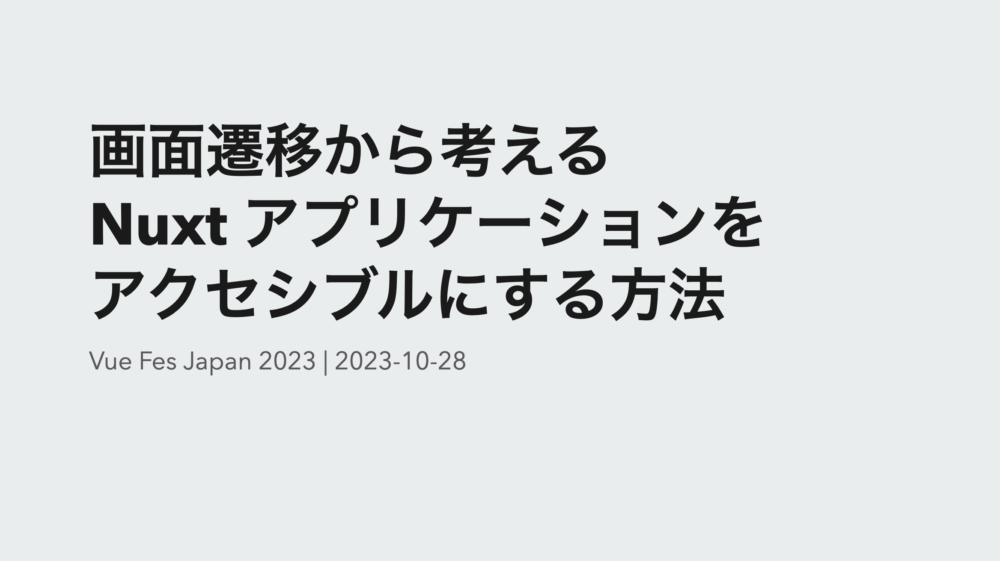
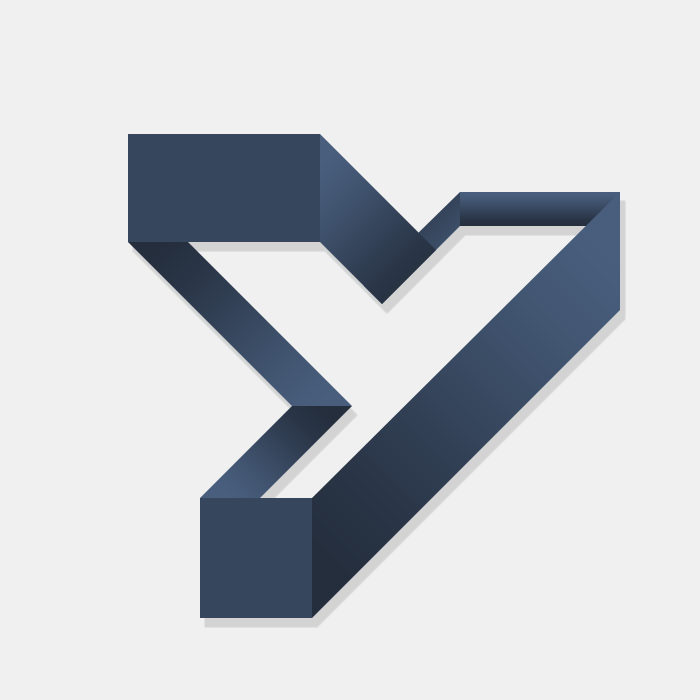
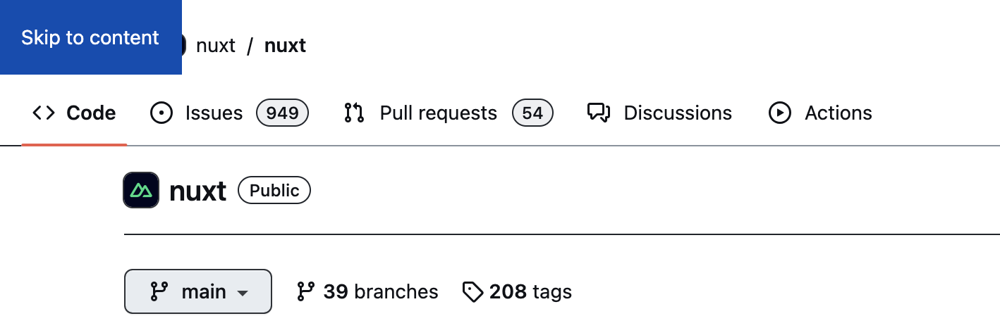

## 翻訳記事一覧

[日本語ページ](https://yamanoku.net/vuefes-japan-2023/ja/) / [English page](https://yamanoku.net/vuefes-japan-2023/en/)

## はじめに

はじめに自己紹介です。



[やまのく](https://yamanoku.net)と申します。

[株式会社クラウドワークス](https://crowdworks.co.jp/)にて、 フロントエンドエンジニアとして施策の開発やデザインシステムの開発にも携わっておりました。現在は技術的負債解消をリードするチームに所属し、レガシーフロントエンド環境の刷新に関わっております。

ウェブの仕様についてやウェブアクセシビリティにまつわることに興味があります。

また、一児の父でゴールデン・レトリバーと3匹の猫の飼い主をやっております。

本題に入る前に今回のテーマに関わる「ウェブアクセシビリティ」とはなにかを説明します。

アクセシビリティとはアクセスと能力の単語を組み合わせたもので、情報や製品、サービスが利用できるようにする意味で使われる言葉です。略して*A11y*とも書かれていることがあります。


ウェブアクセシビリティはウェブの文脈にて考えられるアクセシビリティのことで「利用者の障害の有無やその程度、年齢や利用環境にかかわらず、ウェブで提供されている情報やサービスを利用できること、またはその到達度」とされています。

ウェブアクセシビリティについてお話しする際に、最初に理解しておくべき重要なポイントがあります。それは、「元々ウェブはアクセシブルな設計になっている」ということです。

ここで、コロナ禍で多くの人々がリモート勤務を余儀なくされた時期を思い出してみてください。その時、私たちはオンラインで情報を得たり、発信したりすることが可能でした。

これは、ウェブという媒体を通じて物事がアクセシブルになっている一例です。

そんなウェブのおかげで障害当事者もウェブサービスを通じることでさまざまなものにアクセスできるようになっています。

* Web検索
* ニュース・新聞の閲覧
* ブログ・SNSの閲覧
* 外出時のナビゲーション
* 乗り換え検索
* ショッピング、金融サービスの口座の状況確認
* マイポータルやマイナンバーカードを利用した各種手続き等

これは視覚障害者向けの支援技術の利用状況に関する調査によるもので、彼らがパソコンやスマートフォンを介してさまざまなサービスを利用していることが明らかになっています。

ウェブアクセシビリティを確保することは、障害を持つ人々に対しても公平なサービスを提供するための手段であり、これにより様々な背景を持つ人々がサービスを利用できるようになります。

今回[Vue Fes Japan 2023](https://vuefes.jp/2023/)ということで日本とウェブアクセシビリティに関するタイムリーな話題についてを紹介します。

それは改正障害者差別解消法と環境の整備についてです。

障害者差別解消法は障害を理由とする差別の解消と、障害のある人もない人も、互いにその人らしさを認め合いながら共に生きる社会を実現することを目的とする法律です。

この法律により、障害がある人々を不公平に差別するのではなく、彼らが日常生活を送る上で直面する困難を和らげたり、解決したりするための措置や配慮が求められます。

来年の4月からは、障害のある人々への合理的な配慮を提供することが、民間企業においても努力義務ではなく法的な義務化になります。

「合理的配慮」とは、障害を持つ人が社会に参加する際に必要な特別な支援や調整を指します。これにはさまざまな形があります。

例として、障害を持つ人が筆記が難しい場合に代筆をしてもらう、コミュニケーションを取る際に、絵カードや写真カードやタブレット端末を使用してみる、肢体不自由な人が移動する際には、移動のサポートを提供することも合理的配慮の一環と言えます。

合理的配慮は、障害を持つ人が困難を感じた際、その人の個別のニーズに応じて無理のない範囲で対応していく必要があります。

ですが、合理的配慮が必要な人との関係が長期にわたる場合、毎回対応をすることが双方にとって負担となることがあります。
この負担を減らすため、効率的かつ持続可能なサポート方法を検討することが欠かせません。

事前に改善措置を施しておくことで、さまざまな場面で障害を持つ個々の人々への合理的配慮をスムーズに行えるようになるのですが、これを「環境の整備」と言います。

例えば、聴覚障害者と筆談でコミュニケーションを取る必要がある状況では、タブレットなどの入力装置を準備しておくことで、その人自身が入力できるようにし、都度の対応や外部からの支援を必要としなくなります。

ウェブアクセシビリティは、合理的配慮そのものではなく、事前的な措置として行う「環境の整備」で行うためのものとしての位置づけです。

先ほどの合理的配慮で説明したように、これまで電話や筆談でしか対応できなかったことも、ウェブを介して行うことで非同期的に、そして支援技術を利用して個々人が自分で問い合わせや入力を行えるようになります。

ウェブアクセシビリティを実現することで、利用者の満足度が向上し、対応や問い合わせが減少することで全体の業務効率が向上することが期待されています。

そんなウェブアクセシビリティの重要性を理解したうえで立ち返ってほしいことがあります。

それは私たちがこれまでに作ってきた、そして現在作っているVue.js や Nuxt.jsを使用したアプリケーションが実際にアクセシブルであるかどうか、ということです。

前回のVue Fes Japanでは「[Vue.jsでアクセシブルなコンポーネントをつくるために](https://yamanoku.net/vuefes-japan-online-2022/ja/)」をテーマに、誤ったアクセシビリティ対応についてや、Vue.jsの強みを活かしたアクセシビリティへの配慮とテストについて話させていただきました。

その際[WebAIM](https://webaim.org/)という団体によるクライアントサイドフレームワークのアクセシビリティの対応状況を取り上げました。


数字は改善傾向にありますが、2023年時点でも結果がまだ悪いことが私個人としては気になっています。

私を含むVue.jsやNuxt.jsを用いる開発者たちが、ウェブアクセシビリティを正確に考慮した開発を継続できるよう、今回の発表でもその点を話すことができればと考えています。

今回は「画面遷移」におけるアクセシビリティに焦点を当てて話を進めていきたいと思います。

改めてよろしくお願いいたします。

### クライアントサイドルーティングという手法

まず初めに、「クライアントサイドルーティング」という手法について説明しましょう。

通常の画面遷移では、サーバーサイドが新しいページのHTMLを生成し、それをクライアントに送信して画面を表示します。これが一般的なルーティングの形になります。一方で、クライアントサイドルーティングは全ての処理をクライアント側で完結させる手法です。

この手法は、シングルページアプリケーションや画面内の一部を動的に更新する際に利用されます。

クライアントサイドルーティングにはいくつかの利点があります。

- ページナビゲーションが早い
- クライアントサイドで状態を保持したまま移動ができる
- 2つ以上のレイアウトを入れ子にするNasted Layoutsでの活用
- カスタマイズされたページ間のトランジションアニメーションができる

これらの特長は、ウェブサイトやアプリケーションのユーザー体験を向上させる上で大いに役立ちます。

ページ間のトランジションアニメーションといえば、最近さまざまなクライアントフレームワークで導入されつつある[View Transitions API](https://developer.mozilla.org/ja/docs/Web/API/View_Transitions_API)があります。Nuxt.jsでは[バージョン3.4からexperimentalで導入](https://nuxt.com/blog/v3-4)されています。

現在はView Trainsitions API非対応ブラウザでのフォールバックがないため、そのまま使用する場合は対応するブラウザのみでしか動かないことに注意です。

実際のデモを見てみましょう。

<video src="https://user-images.githubusercontent.com/904724/231222082-6bd4aeae-3026-407e-b3be-658df6305748.mp4" controls style="width: 100%; border: 1px solid var(--y-image-border-color);" loop></video>

画面遷移するごとにクリックした対象部分が拡大されているような効果が入っています。

異なる２要素間にトランジション効果をつけることができるため、ページ全体やコンポーネント単一でのトランジションはできたものから更に一段階上の画面遷移を実現できるようになります。

スムーズな画面遷移を実現するための手法も増えて、導入障壁も下がりつつあるため、シングルページアプリケーションが出始めた当初よりクライアントサイドルーティングはより身近なものとなってきたと思います。

## 画面遷移におけるアクセシビリティの問題点

より便利に身近になってきたクライアントサイドルーティングですが、それによって見逃してしまうアクセシビリティの問題は存在します。次は問題点についてと、その問題の解決策についてを紹介していきます。

### 何が変化したかが支援技術に伝わらない

まず１つに「何が変化したかが支援技術に伝わらない」というのがあります。これは画面遷移のアクセシビリティを考慮する際に最も気付きづらい問題です。

クライアントサイドルーティングを用いた画面遷移は、視覚的にはどの部分が変わったのか明確に捉えることができるかもしれません。しかし、支援技術を利用してページを閲覧しているユーザーはその変化に気づきにくい可能性があります。

画面内のものを読み上げてくれる支援技術のスクリーンリーダーを使用してクライアントサイドルーティングの様子を見てみましょう。

<video src="../videos/demo-movie-01.mov" controls style="width: 100%; border: 1px solid var(--y-image-border-color);"></video>

このように画面上では適切にページが切り替わっているものの、スクリーンリーダーを使用しているユーザーにはその変化が通知されないことが分かるかと思います。

このような問題はどのように回避すればよいのでしょうか。

解決する手段の１つとしてWebコンテンツをよりアクセシブルにするための技術仕様であるWAI-ARIAを活用した[ARIAライブリージョン](https://developer.mozilla.org/ja/docs/Web/Accessibility/ARIA/ARIA_Live_Regions)というものがあります。ARIAライブリージョンは、動的なコンテンツ変更をユーザーに通知するために使用されます。

画面遷移時にユーザーに通知を行うアクセシブルな方法として、ARIAライブリージョンを利用して `title` 要素の変更を通知する手法があります。

具体的な手法を説明していきます。

まずはページ単位で `useHead` からそのページの `title` を指定します。

```ts
useHead({
  title: 'About Page',
});
```

次にタイトル要素を取得してきて、ページが移動する度に変更を検知させます。

```ts
const route = useRoute();
const message = ref<string>("");

const announceRoute = () => {
  const title = document.title;
  message.value = title;
};

onMounted(() => {
  announceRoute();
});

watch(
  () => route.fullPath,
  () => {
    setTimeout(() => {
      announceRoute()
    }, 300);
  }
);
```

今回の例では Route のパスを検知した上で変更させています。`setTimeout` を使用して少し遅延させることで、支援技術によっては直ちに反映されない通知の取得タイミングのズレを補正しています。

そして通知させるための変数をHTML側に組み込みます。

```html
<p
  role="status"
  aria-live="assertive"
  class="sr-only"
>
  ｛｛ message ｝｝
</p>
```

`aria-live` というWAI-ARIAを使用することで支援技術に通知させるようにできています。値は `assertive` を使用することで変更が即座にアナウンスされ、ユーザーの注意を引くことができます。

対応するHTML要素はスクリーンリーダーが検知する目的のみに使用されるため、通常は画面上では非表示になるようにします。

```css
.visually-hidden {
  position: absolute;
  width: 1px;
  height: 1px;
  padding: 0;
  margin: -1px;
  overflow: hidden;
  clip: rect(0, 0, 0, 0);
  white-space: nowrap;
}
```

ここで注意することとしては `display: none` で非表示にすると支援技術では存在を検知できないため「視覚的にだけ」見えないようにする必要があります。このスタイル手法は通称 [Visually Hidden](https://www.a11yproject.com/posts/how-to-hide-content/) と呼ばれているものです。

それでは変更したものを一緒に見てみましょう。

<video src="../videos/demo-movie-02.mov" controls style="width: 100%; border: 1px solid var(--y-image-border-color);"></video>

このようにしてリンクが押された場合に画面が切り替わっていることを通知できるようになりました。

Nuxt.js で作られたマストドンクライアントの「[elk](https://github.com/elk-zone/elk)（エルク）」ではこの手法をコンポーネントとして活用しています。

- [elk/components/aria/AriaAnnouncer.vue](https://github.com/elk-zone/elk/blob/5d09e7d2ab473d3fe049ace8468455baa18de9b2/components/aria/AriaAnnouncer.vue)

支援技術を利用してページを確認する際には、ページが読み込まれた後に現在のページタイトルがアナウンスされるのを聞くことができます。

ソースコードは公開されているので、興味がある方は実際のアプリケーションがどのように動作するのかを確認しながら、チェックしてみてください。

### フォーカスマネジメント

次に画面が切り替わったことでのキーボード操作についてです。

キーボード操作では、エンターキーまたはスペースキーで項目を決定したり、矢印キーで項目を移動したり、エスケープキーで操作を解除するなどの操作があります。

今回は、その中でも特にタブキーを使用したフォーカス移動に関する問題点をデモを通じてご紹介します。

<video src="../videos/demo-movie-03.mov" controls style="width: 100%; border: 1px solid var(--y-image-border-color);"></video>

ページ下部に位置するリンクを選択した際には、確かに画面のコンテンツは更新されますが、フォーカスの移動すると、以前の位置、すなわち下部のリンクからの移動となってしまいます。

状況によってこれが問題とならないこともありますが、今回のデモで示すような状況ではこの挙動が非常に不都合であることがはっきりと分かります。

こうした問題を解消するため、次に移動してほしい要素へフォーカスするための処理を挟む必要があります。

Vue.js での対象の要素を取得する場合、`ref` を使用しテンプレート参照します。

```ts
const focusedRef = ref<HTMLElement>();
```

タブキーを使用したフォーカス移動の際には、`a` 要素や `button` 要素のようなものはデフォルトでフォーカスを受け入れることができますが、フォーカスできないものもあります。

この問題を解決するためには、`tabindex` 属性を使用することで、要素へフォーカス可能になるよう設定できます。

```ts
const announceRoute = () => {
  if (focusedRef.value) {
    focusedRef.value.focus();
  }
};
```

この値を `-1` に設定すると、要素は通常のキーボード操作ではフォーカスされなくなり、誤って操作されるリスクを防ぐことができます。その後、直接対象の要素をフォーカスさせています。

次に考えるべき点は、どの位置にフォーカスを当てるか、ということです。

ページを移動した際、最初にフォーカスを当てるべき位置としては、ページの主要なコンテンツを包含する `main` 要素が適していると考えられます。しかし、この方法には問題点があります。

具体的な例を見てみましょう。ここでは、アバウトページへ遷移した際に `main` 要素にフォーカスを当てるような動作を紹介します。

<video src="../videos/demo-movie-04.mp4" controls style="width: 100%; border: 1px solid var(--y-image-border-color);"></video>

気付きづらいかもしれませんが、`main` 要素にフォーカスが当たると、内包する全ての内容を一度に読み上げてしまいます。

今回は `main` 要素内のものが少ないため読み上げるものはわずかでしたが、実際の場合はこれよりも多いコンテンツがあることが想定されます。

これは Windows で利用できる [NVDA](https://www.nvda.jp/) というスクリーンリーダーでの結果です。一方で macOS のスクリーンリーダーではこのような読み上げ方をしませんが、デバイスやOSによってスクリーンリーダーの挙動は異なるため、注意が必要です。

では、この問題を解決するためにはどうしたらよいのでしょうか。

対象が大きすぎて全体を一度に読み上げてしまうのであれば、フォーカス対象の要素を小さくしてみるのが一つの方法です。

<video src="../videos/demo-movie-05.mp4" controls style="width: 100%; border: 1px solid var(--y-image-border-color);"></video>

ページ内に見出し要素が存在する場合は、その要素にフォーカスを移動させるように変更することをお勧めします。

もし見出しがない場合は、スキップリンクを用意して、そこへフォーカスを移動させ、ARIAライブリージョンでページタイトルを読み上げるのも１つの方法だと思っています。

スキップリンクとは、主にキーボードを使用してブラウジングするユーザーのための機能で、ページの先頭から直接メインコンテンツの開始部分へジャンプできるページ内リンクのことを指します。

この手法自体はウェブアクセシビリティで必須のものではありませんが、スキップリンク自体があれば使う人もいるため一定効果があるものだと考えられています。

GitHubでもこの方法が採用されており、ページの先頭からメインコンテンツの直前の要素に簡単に移動することができ、そこから続けてメインコンテンツにアクセスすることが可能です。



スキップリンクの作成方法に関しては、[Vue.js公式ドキュメントのアクセシビリティページ](https://ja.vuejs.org/guide/best-practices/accessibility.html#skip-link)でも詳しく説明されていますので、是非ご覧ください。

以上の内容からページ遷移した後にフォーカスする対象としては、情報量が少ない箇所を選ぶことが望ましいと言えます。

フォーカスの開始位置において「必ずここにする」という明確なルールは存在しません。状況によっては、フォーカス位置を変更しない方がユーザーにとって理解しやすい場合もあるでしょう。

しかし、その際にはユーザーが「位置が変わらない」という挙動を学習する必要があります。そのため、サーバーサイドでのページ遷移と同様、**ブラウザの上部から遷移が始まるような形**を基本としておくことが重要です。

### 過度なアニメーションで閲覧が阻害される

最後に「過度なアニメーションで閲覧が阻害される」というのがあります。

ページトランジションアニメーションを使用することは、画面遷移の流れをスムーズにしてユーザーへの没入感を高めることができます。

一方で、全てのユーザーにとって最適な解決策であるとは限りません。特に前庭障害や認知障害を持つユーザーにとっては、アニメーションが原因で吐き気を催したり、混乱を引き起こしたりするリスクがあります。

現在のPCやスマートフォンの多くでは、OSレベルで「視差効果を減らす」設定を提供しています。

この設定は、画面上の動く視差効果を抑制し、より穏やかな表示に変更するものです。特にスマートフォンユーザーの中には、バッテリーの持ちを延ばすためにこの設定をONにしている方もいらっしゃるかもしれません。

視差効果を減らすための設定をフロントエンド側で制御する際には、`prefers-reduced-motion` を使用できます。

JavaScriptとWeb Animations APIを使用してアニメーション設定しているのであれば、`window` オブジェクトの `matchMedia` メソッドを使ってユーザーの設定を取得し、`change` イベントリスナーを使ってアニメーションを制御することが可能です。

```js
const mediaQuery = window.matchMedia('(prefers-reduced-motion: reduce)');
mediaQuery.addEventListener('change', () => {
  console.log(mediaQuery.media, mediaQuery.matches);
  // JavaScriptでのアニメーションを止める
});
```

ただし、この方法ではユーザーが設定を変更した時点で内容を反映させる場合、ブラウザをリロードする必要があります。

Vue.jsでComposition APIを使用している場合、[VueUse](https://vueuse.org/)という状態管理のユーティリティライブラリが使えます。この中に[視差効果に関連するコンポジション関数](https://vueuse.org/core/usepreferredreducedmotion/)が含まれています。

<video src="../videos/demo-movie-06.mov" controls style="width: 100%; border: 1px solid var(--y-image-border-color);" loop></video>

このようなツールを利用することで、よりスムーズにユーザーの設定に合わせた表示切り替えが実現できます。

もしCSSを使用して手早く設定を反映させたい場合、全ての要素に対して `animation` プロパティやそれに準ずるものを無効にすることで対応可能です。

```css
@media (prefers-reduced-motion: reduce) {
  *,
  ::before,
  ::after {
    animation-delay: -1ms !important;
    animation-duration: 1ms !important;
    animation-iteration-count: 1 !important;
    background-attachment: initial !important;
    scroll-behavior: auto !important;
    transition-duration: 0s !important;
    transition-delay: 0s !important;
  }
}
```

また、View Transitions APIを使用している場合も、`animation` プロパティを無効に指定することでアニメーションを停止させることができます。

```css
@media (prefers-reduced-motion) {
  ::view-transition-group(*),
  ::view-transition-old(*),
  ::view-transition-new(*) {
    animation: none !important;
  }
}
```

アニメーションはCSSの設定を変更することで簡単に無効化することが可能です。

しかし、それによって実際に違和感なく動作するかどうか、実際に確認することが必要です。
視差効果を無効化する場合だけでなく、他のケースでも同様です。

コード上での変更を完了しただけで満足するのではなく、変更が意図通りに機能しているかを必ず確認してください。

以上がNuxt.jsにおける画面遷移についてのアクセシビリティについてでした。

## 画面遷移を Web API から解決する

次に、Routerライブラリやフレームワークに依存しない、将来のクライアントサイドルーティングでの開発に活用できるWeb APIについて紹介していきます。

画面遷移に関連するWeb APIとして、多くの方が[History API](https://developer.mozilla.org/ja/docs/Web/API/History_API)についてを思い浮かべるでしょう。

かつて「Pjax」と呼ばれる`pushState`とAjaxを組み合わせたページ遷移に関する技術が利用されていました。ここで言及される`pushState`は、History APIのメソッドの一つです。

Vue Routerの場合、このHistory APIを模した動作を提供しており、`push`、`replace`、`go`などのメソッドが存在します。

ただし、History APIをそのまま使用するにはいくつか実装上の問題が発生します。

* `iframe`内の遷移も含んでしまうため、Top Level Frameで履歴を管理しようとすると、意図しない形で履歴が破壊される可能性がある
* ページ上で発生する`Navigation`を直接フックする方法が存在しないため、全てのリンククリックを監視する必要がある。しかしこれだけでは完璧に遷移をインタラプトすることはできない
* 遷移をインデックスで管理するため、どのインデックスがどの状態に対応しているかを別途管理する必要がある
* History APIとブラウザの履歴との連携はブラウザによって差異がある
* `pushState`で保存する`state`には制限が多く、かつ壊れやすい

これらの問題を回避し、クライアントサイドルーティングを効果的に実現するため、Vue Routerのような各種Routerライブラリが開発されました。これらのライブラリによって、History APIは隠蔽された形で利用されています。

Routerによりブラウザに画面遷移を通知することは可能ですが、その通知をどのタイミングで行うべきかの情報はブラウザから提供されていません。これが意味するのは、わざと通知のタイミングをずらすような実装、例えば `setTimeout` を使用するようなもの、が必要になってしまいます。

そうした問題を解決するために新たに策定されているものが[Navigation API](https://developer.mozilla.org/en-US/docs/Web/API/Navigation_API)です。

Navigation APIはHistory APIでは解決できなかったクライアントサイドルーティングの問題点を解消してくれます。

このAPIを利用することで、画面遷移の開始と終了のタイミングを通知することができ、インターセプトを利用してスクロール位置の復元やフォーカス位置の調整なども行うことが可能になります。

特に、ページを進めるだけでなく、戻るボタンを使用した際やページのリロード時など、様々なシチュエーションで役立ちそうな機能があります。これにより、アクセシビリティを担保したユーザー体験の向上が期待できます。

2023年10月現在、Chromeでは実装されており動作するようになっていますが、SafariやFirefoxではまだ実装されていません。


しかし、ウェブの相互運用性を向上させることを目的としたプロジェクト「[Interop](https://github.com/web-platform-tests/interop)」において、各モダンブラウザで使用可能となるよう注力されているAPIの一つとして[投票されています](https://github.com/web-platform-tests/interop/issues/435)。

過去に注力されたAPIの例としては、Container Queries、Inert属性、スクロールに関するCSSプロパティなどがありました。

こちらの対応状況については今のところ予測が難しい部分もありますが、各モダンブラウザにおいて取り入れられるのはそう遠くはなさそうだと期待されています。

## おわりに

いかがだったでしょうか。

今回のテーマが、これまで知らなかった方々にとって新たな学びとなり、役立つ情報が得られたならば、それは大変嬉しく思います。

お話しした内容が、皆様にとって知らなかったことも多いかもしれません。そのため、少し複雑に感じる部分があるかもしれませんが、ご一緒に考えていただければ幸いです。

最初にも触れましたが、ウェブサイトは元々アクセシブルな作りとなっていました。しかし、近年のフロントエンド開発の進化によってクライアントサイドルーティングが主流となり、以前は問題視されなかった多くのアクセシビリティの問題が表面化してきています。

サーバーサイドルーティングでは問題とならなかったアクセシビリティの課題が、クライアントサイドルーティングの導入により顕在化しているとも言えるでしょう。

誤解を恐れずに言うとクライアントサイドルーティングと言う選択肢には、既存のウェブの利点をあえて捨て去り、ゼロから複雑さに挑戦するという覚悟が必要だと私は考えています。

しかし、これは決して**クライアントサイドルーティングを使ってはいけない**と言いたいわけではありません。

クライアントサイドで複雑な状態を管理し、優れたユーザー体験を提供するためには、クライアントサイドルーティングのような技術が今もなお必要とされています。

クライアントサイドで複雑な状態を管理し、優れたユーザー体験を提供するためには、クライアントサイドルーティングのような技術が今もなお必要とされています。それらを利用することで実現可能な新しい体験や価値を、私たち開発者は追求し続けるべきだと考えています。

アクセシビリティを考えることは個々の開発者にとって非常に重要ですが、使用しているフレームワーク自体がアクセシビリティをどのように取り扱っているかを理解することも重要です。

最後に、Nuxt.jsにおけるアクセシビリティの取り組みについて触れてこの発表を終わろうと思います。

実は[Nuxt.jsのロードマップ](https://nuxt.com/docs/community/roadmap)を調べると、アクセシビリティに関連する項目が含まれていることが分かります。これは皆さんにとって嬉しい情報かもしれません。


例えば、先ほど紹介したARIAライブリージョンの実装や、アクセシビリティテストエンジンである「[axe-core](https://github.com/dequelabs/axe-core)」をビルトインする、ナビゲーション時のフォーカス管理など、様々なタスクが挙げられています。

今後、Nuxt.jsのアクセシビリティへの取り組みに・ロードマップの進展を見守りつつ、私たち自身もアクセシビリティ向上のために努めていく必要があると思っております。

以上で発表を終わります。ご清聴いただきありがとうございました。

## 参考資料

* [ウェブアクセシビリティ導入ガイドブック｜デジタル庁](https://www.digital.go.jp/resources/introduction-to-web-accessibility-guidebook)
* [第3回支援技術利用状況調査報告書 | 日本視覚障害者ICTネットワーク](https://jbict.net/survey/at-survey-03)
* [リーフレット「令和６年４月１日から合理的配慮の提供が義務化されます！」 - 内閣府](https://www8.cao.go.jp/shougai/suishin/sabekai_leaflet-r05.html)
* [合理的配慮の提供 | 障害者の差別解消に向けた理解促進ポータルサイト](https://shougaisha-sabetukaishou.go.jp/goritekihairyo/)
* [WebAIM: The WebAIM Million - The 2023 report on the accessibility of the top 1,000,000 home pages](https://webaim.org/projects/million/)
* [Server Routing VS Client Routing | Vike](https://vite-plugin-ssr.com/server-routing-vs-client-routing)
* [Transitions · Get Started with Nuxt](https://nuxt.com/docs/getting-started/transitions#view-transitions-api-experimental)
* [What we learned from user testing of accessible client-side routing techniques with Fable Tech Labs | Gatsby](https://www.gatsbyjs.com/blog/2019-07-11-user-testing-accessible-client-routing/)
  * [Accessible JavaScript Routing Prototypes](https://marcy.codes/prototypes/routing/index.html)
* [Preferreds-reduced-motion: 動きが少ないほうがよい場合もあります  |  Articles  |  web.dev](https://web.dev/articles/prefers-reduced-motion?hl=ja)
* [Smooth and simple transitions with the View Transitions API - Chrome for Developers](https://developer.chrome.com/docs/web-platform/view-transitions/)
* [Navigation API による「JS での画面遷移」と SPA の改善 | blog.jxck.io](https://blog.jxck.io/entries/2022-04-22/navigation-api.html)
* [Accessibility roadmap · Issue #23255 · nuxt/nuxt](https://github.com/nuxt/nuxt/issues/23255)
* [Webアプリケーションアクセシビリティ ――今日から始める現場からの改善](https://gihyo.jp/book/2023/978-4-297-13366-5)
* [Webアクセシビリティセミナー ～改正障害者差別解消法の2024年4月1日施行にあたり、企業は何をすべきか～ - YouTube](https://www.youtube.com/watch?v=2gESGUHjUCs)
